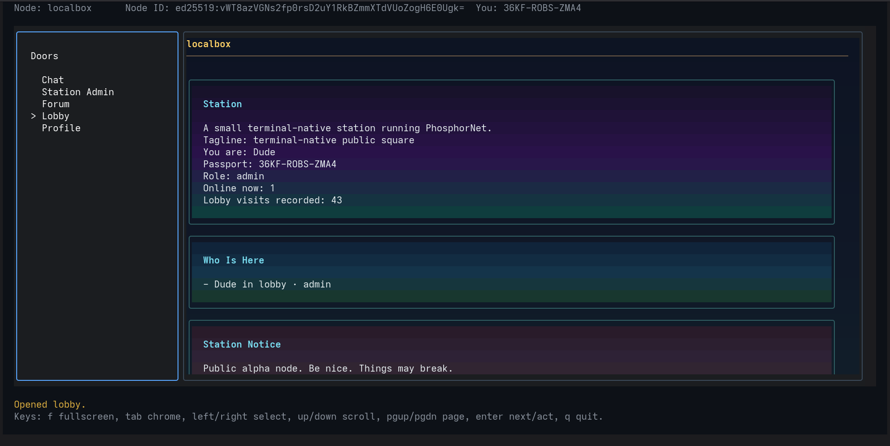
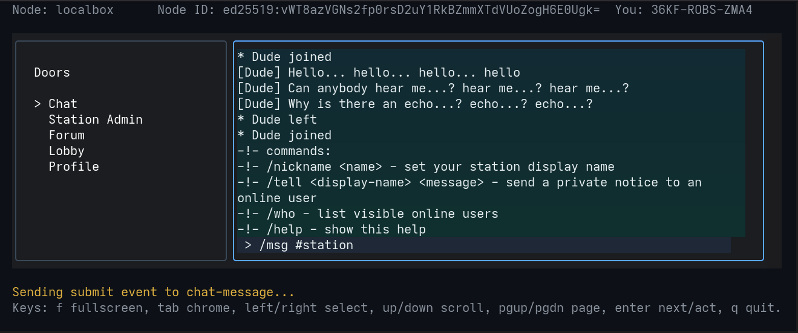
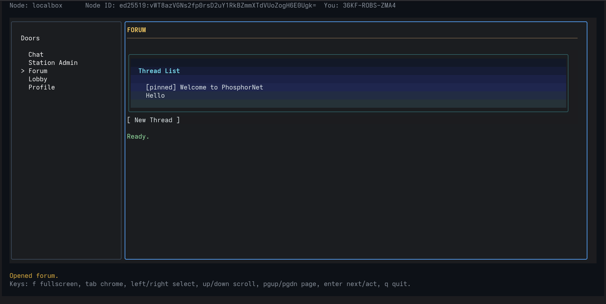
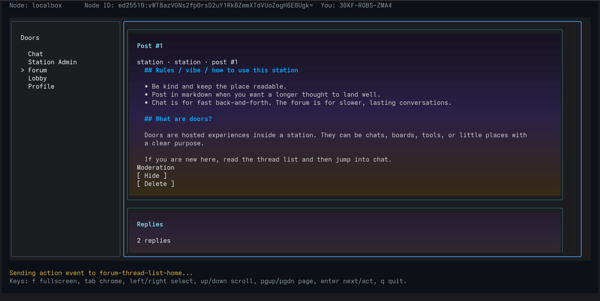
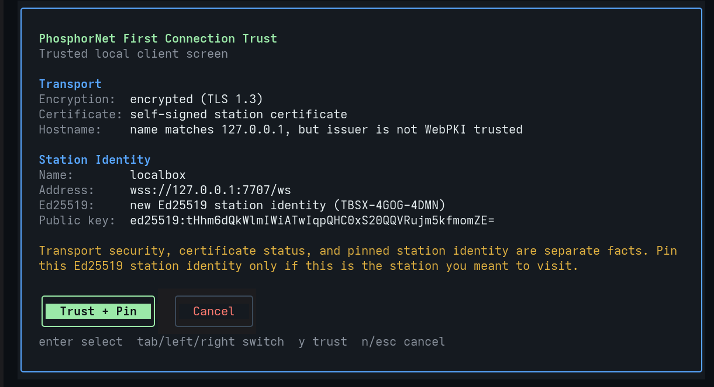

# PhosphorNet

**PhosphorNet is a self-hostable platform for interactive terminal apps.**

It is for the space between "SSH into a box and run scripts" and "build a private web app."

A PhosphorNet station can host chat, forums, dashboards, admin panels, games, maintenance tools, and experiments. Users connect with the `phosphor` terminal client using a portable Ed25519 passport identity.

Door code runs on the station. The station sends declarative JSON UI trees over WebSockets. The trusted client renders that UI locally and sends back structured events such as button presses, menu choices, form submissions, and approved key input.

Remote apps do not control your terminal.

The goal is not to recreate the web inside a terminal. The goal is a smaller, inspectable, terminal-native runtime for hosted tools and social spaces where identity, access policy, and data stay close to the station operator.

It does not provide shell access. It provides structured remote apps rendered by a local terminal client.

It has some of the texture of classic BBSes, but the usecases extend beyond nostalgia.

<table>
  <tr>
    <td align="center">
      <br>
      Lobby
    </td>
    <td align="center">
      <br>
      Chat
    </td>
    <td align="center">
      <br>
      Forum
    </td>
  </tr>
  <tr>
    <td align="center">
      <br>
      Forum thread
    </td>
    <td align="center">
      <br>
      Trust screen
    </td>
    <td></td>
  </tr>
</table>

## What It Is Good For

PhosphorNet is useful when you want people to connect to a shared place from their terminal, without giving them a shell account or building a full web app.

It is a good fit for:

- a terminal-based social space for computer clubs, hackerspaces, retrocomputing groups, or technical communities
- a homelab control panel with status pages, logs, notes, and maintenance actions
- internal tools for a small server, workshop, studio, or project space
- chat and forum spaces for people who already like terminal software
- small multiplayer games, shared experiments, bots, and collaborative toys
- admin panels for services that should not have a public browser UI
- prototypes for safer remote interfaces where the server does not control the user's terminal

For example, instead of exposing a web dashboard for a home server, you could run a PhosphorNet station. Trusted users connect with `phosphor`, open doors for status, logs, chat, or admin tasks, and the station keeps its data and access rules local.

The currently shipped doors include:

- `lobby`: the station landing page, with presence and station notices
- `profile`: local user profiles with a display name, status line, and bio
- `chat`: a shared room chat
- `forum`: board-style threads and replies
- `admin`: station settings, door controls, user moderation, logs, and maintenance tools

The important idea is simple: the station runs the apps, but your own terminal client draws the screen. The station sends structured UI, not raw terminal commands, so a door can offer buttons, forms, lists, and text without taking over your terminal.

PhosphorNet is not trying to replace the web. It is for smaller, self-hosted spaces where the terminal is the front door, identity is portable, and apps can be simple scripts instead of websites.

## Quick Start

### Install

Client only:

```bash
curl -fsSL https://aiyoyo.org/phosphornet/install.sh | sh -s -- --client
phosphor init
```

Station/node:

```bash
curl -fsSL https://aiyoyo.org/phosphornet/install.sh | sh -s -- --node
phosphord serve
```

All binaries:

```bash
curl -fsSL https://aiyoyo.org/phosphornet/install.sh | sh -s -- --full
```

The default installed layout is intentionally boring:

```text
/usr/local/bin/phosphor
/usr/local/bin/phosphord
/usr/local/bin/switchboard
/usr/local/share/phosphornet/doors
/etc/phosphornet/node.toml
/var/lib/phosphornet/phosphornet.db
```

Tagged releases build Linux and Windows archives:

```text
phosphornet_linux_amd64.tar.gz
phosphornet_linux_arm64.tar.gz
phosphornet_windows_amd64.zip
phosphornet_windows_arm64.zip
```

`install.sh` downloads the matching Linux tarball from the latest `AiyoyoSoftware/PhosphorNet` GitHub Release by default. Set `PHOSPHORNET_VERSION=v0.1` for an exact tag, or pass `PHOSPHORNET_ARTIFACT_URL` to test an exact archive URL.

Uninstall installed binaries and bundled doors:

```bash
curl -fsSL https://aiyoyo.org/phosphornet/install.sh | sh -s -- --uninstall --full
```

Add `--purge` only when you also want to remove `/etc/phosphornet/node.toml` and `/var/lib/phosphornet/phosphornet.db`.

### Connect

After installing the client, connect to a station:

```bash
phosphor connect --addr wss://127.0.0.1:7707/ws
```

The first connection shows a local trust screen before pinning the station identity.

### Local Development

For development from a source checkout, requirements are:

- Go matching the version in `go.mod`
- A terminal that works well with Bubble Tea alternate-screen programs
- Optional: Python 3.11+ for Python doors
- Optional: SQLite CLI tools for inspecting local state

The default SQLite path uses pure Go SQLite through `modernc.org/sqlite`, so CGO is not required for the normal development path.

From the repository root:

```bash
go run ./cmd/phosphord init --name localbox --out node.toml
```

Start the daemon:

```bash
go run ./cmd/phosphord serve --config node.toml
```

By default, the station listens on:

```text
wss://127.0.0.1:7707/ws
```

In another terminal, connect with a disposable local development identity:

```bash
go run ./cmd/phosphor connect --addr wss://127.0.0.1:7707/ws --quick
```

Health check:

```bash
curl -k https://127.0.0.1:7707/healthz
```

Expected response:

```text
ok
```

## What Works Today

PhosphorNet is in MVP / public-alpha preparation. The core loop works today:

- `phosphor` terminal client
- `phosphord` station daemon
- Ed25519 passport identity and station challenge verification
- WSS transport with self-signed station certificates
- trusted-client rendering of declarative JSON UI
- Lua doors as the default embedded runtime
- stdio command doors for Python or other languages, with optional Podman isolation
- SQLite-backed scoped state
- bundled lobby, profile, chat, forum, and admin doors
- station and door access controls, including admin-only and invite-only modes

Some parts are still MVP-grade:

- the switchboard is only a scaffold
- only `open_door` transitions are implemented end-to-end
- rooms are currently implicit per door
- presence is live and in-memory
- reconnects create a fresh session; brief drops may reopen the last safe door, but scroll position and input drafts are not restored
- the Lua sandbox is useful hardening rather than complete hostile-code isolation

## Architecture

PhosphorNet currently has three command-line programs:

| Program | Purpose |
|---|---|
| `phosphor` | Trusted terminal client. Renders station chrome and remote door UI locally. |
| `phosphord` | Station daemon. Hosts doors, authenticates passports, stores state, and serves WebSocket sessions. |
| `switchboard` | Early relay/rendezvous scaffold. Currently health-checkable, not full federation. |

High-level flow:

```text
phosphor client
  └── connects over WebSocket / WSS
        └── phosphord station
              ├── authenticates passport challenge
              ├── verifies station access policy
              ├── loads door manifests
              ├── invokes Lua or stdio door runtimes
              ├── stores scoped state in SQLite
              └── returns declarative UI trees
```

Door code runs on the station, not on the client. Doors return structured UI and structured effects. The station daemon applies effects, stores state, and enforces policy. The trusted client owns local rendering and input routing.

## Persistent Passports

Create a persistent local passport:

```bash
go run ./cmd/phosphor passport create
```

Show the passport public key and fingerprint:

```bash
go run ./cmd/phosphor passport show
```

Connect with the default persistent passport:

```bash
go run ./cmd/phosphor connect --addr wss://127.0.0.1:7707/ws
```

Default client files:

```text
~/.config/phosphornet/passport.toml
~/.config/phosphornet/known_nodes.toml
```

The private key stays on the client machine. Stations see the public key and verify a challenge-response signature.

## Station Identity

`phosphord` can serve WSS with a self-signed certificate derived from the station identity. The TLS layer provides encrypted transport. The station identity itself is checked through an Ed25519 node challenge and local known-node pinning, similar in spirit to SSH known hosts.

On a first connection, `phosphor` shows a trusted local Bubble Tea screen that separates the Ed25519-signed station name, transport encryption, certificate status, hostname verification, and Ed25519 station identity before saving the pin.

If a station key changes for the same address, the client refuses to connect until the local pin is replaced.

For local development after regenerating a node:

```bash
go run ./cmd/phosphor connect \
  --addr wss://127.0.0.1:7707/ws \
  --replace-known-node
```

Use that only when you intentionally replaced the station identity.

## Bundled Doors

| Door | Description |
|---|---|
| `lobby` | Station landing page with presence, station notice, and profile prompts. |
| `profile` | Station-local display name, status line, and bio. |
| `chat` | Shared room chat with presence, slash commands, and broadcast re-rendering. |
| `forum` | Classic board-style forum with threads, replies, drafts, pinned welcome content, and moderation actions. |
| `admin` | Admin-only Station Admin console for doors, users, access control, storage summaries, runtime info, logs, notices, maintenance mode, and manifest reloads. |

Public-station survival primitives are documented separately in `docs/PhosphorNet_public_station_moderation.md`. Advanced reputation systems are out of scope, but local station policy now covers bans, mutes, door freezes, maintenance notices, content hide/delete, per-user event/open-door rate limits, moderation notes, and abuse-relevant activity review.

## Client Controls

| Key | Action |
|---|---|
| `tab` | Switch focus between trusted chrome sections. |
| `left` / `right` | Cycle selectable items inside the focused section. |
| `up` / `down` | Scroll the focused panel. |
| `enter` | Open a door, activate a button/menu item, or submit input. |
| `pgup` / `pgdown` | Scroll the remote viewport. |
| `ctrl+u` / `ctrl+d` | Scroll the remote viewport. |
| `home` / `end` | Jump to the top or bottom of remote content. |
| `f` | Toggle fullscreen door mode. |
| `esc` | Leave fullscreen or return focus to the door rail. |
| `q` | Quit. |

When an input or textarea is focused, printable keys go into that component instead of triggering global shortcuts. `ctrl+c` still quits.

## Door Runtime Model

Doors implement lifecycle functions:

```text
init
view
update
on_join
on_leave
tick
```

Every runtime receives the same request envelope and returns the same response envelope, regardless of whether the door is embedded Lua or an external stdio command.

Doors can return:

- a declarative UI tree
- state operations
- broadcasts
- notifications
- navigation transitions

Current transition support includes `open_door`. Other declared transition kinds are reserved contract space until they are implemented end-to-end.

## Door State

Door state is scoped as:

| Scope | Meaning |
|---|---|
| `user` | Per-door, per-user state. |
| `room` | Per-door, per-room state. Current MVP rooms are implicit per door. |
| `global` | Per-door station-global state. Writes require admin/sysop authority. |

State operations are applied atomically. If a batch contains an invalid or unauthorized operation, none of it is committed.

Lua and the Python stdio SDK expose helper APIs for common state operations such as get, set, append, delete, clear, replace, and all.

## Door Manifests

Each door lives under the configured `doors_dir` and has a `manifest.toml`:

```toml
id = "hello"
name = "Hello"
entry = "app.lua"
visibility = "public"
access = "public"
```

Python door example:

```toml
id = "example_python"
name = "Example Python Door"
runtime = "stdio"
command = ["python3", "app.py"]
visibility = "public"
access = "public"

[isolation]
mode = "host"
```

Useful manifest fields:

| Field | Meaning |
|---|---|
| `id` | Stable door identifier. |
| `name` | Display name shown in the client. |
| `entry` | Lua door entrypoint file. Must resolve inside the door directory. |
| `runtime` | Optional runtime name. `lua` is embedded; `stdio` runs a manifest command or Podman image through the stdio ABI. |
| `command` | Direct `stdio` argv, for example `["python3", "app.py"]` or `["./door-binary"]`. For Podman isolation, optional command/args are appended after the image. |
| `visibility` | `public`, `private`, or `hidden`. |
| `access` | `public`, `invite_only`, or `admin`. |
| `allowlist` | Public keys or fingerprints allowed into an invite-only door. |
| `capabilities` | Runtime authorities this door may request. |
| `permissions` | Deprecated compatibility metadata mapped to capabilities for older doors. |
| `isolation` | Used by `stdio`. Missing `mode` defaults to Podman; `mode = "host"` is the explicit trusted-host opt-out. |
| `sandbox` | Optional Lua sandbox override. |
| `settings` | Optional operator setting schema. Defaults live in the manifest; edited station values live in SQLite and reach doors as `ctx.settings`. |

Containerized stdio door example:

```toml
id = "weather"
name = "Weather"
runtime = "stdio"

[isolation]
image = "localhost/phosphornet/weather-door:0.1.0"
network = "none"
read_only = true
timeout_ms = 1500
memory = "128m"
cpus = 0.25
pids_limit = 64
```

Podman isolation does not create a new runtime protocol. `phosphord` still writes one canonical runtime request JSON document to stdin and reads one canonical runtime response JSON document from stdout. Third-party image doors are expected to contain their code inside the image; `phosphord` does not mount the station's real door directory into arbitrary containers by default.

The bundled Python SDK has a reusable base image at `sdk/python/Dockerfile`:

```bash
podman build -t localhost/phosphornet/python-door-sdk:latest sdk/python
```

Python door images can inherit it, copy their door module into `/door`, and set `PHOSPHORNET_DOOR_ENTRY`.

Host stdio is explicit:

```toml
[isolation]
mode = "host"
```

Example operator settings:

```toml
[settings.motd]
type = "textarea"
label = "Message of the day"
default = "Welcome to this PhosphorNet station."

[settings.show_online_users]
type = "bool"
label = "Show online users"
default = true
```

## Security Boundary

PhosphorNet’s core safety rule is simple:

> Remote doors send structured UI. They do not control your terminal.

The current client contract is designed so stations and doors do not get authority to:

- execute code on the client
- send raw terminal escape sequences as UI authority
- overwrite trusted client chrome
- access local files
- access the shell
- read the clipboard
- receive passport private keys

The trusted client renders remote UI locally, sanitizes text, bounds render trees, and keeps station chrome separate from door content.

Lua doors run with configurable sandbox profiles. The strict profile avoids filesystem and process libraries. This is an MVP hardening layer, not a promise that arbitrary hostile code is safe to run without additional isolation.

Door manifest `capabilities = [...]` remain PhosphorNet protocol authority: they control which structured effects a door may ask `phosphord` to perform. Host resources such as filesystem, network, process, memory, CPU, and container image selection belong under `[isolation]`, not under capabilities.

## Access Control

Stations support public and invite-only modes:

```toml
[access]
mode = "invite_only"
allowlist = [
  "base64-ed25519-public-key",
  "ABCD1234",
]
admins = [
  "base64-ed25519-admin-public-key",
]
```

Door-level access modes:

| Access | Meaning |
|---|---|
| `public` | Any authenticated station user can open the door. |
| `invite_only` | Only the door allowlist can open the door. |
| `admin` | Only admin/sysop sessions can open the door. |

Door visibility is separate from access. A door can be accessible but hidden from the normal rail.

Door capabilities are separate again: access controls who can open a door, while capabilities control which privileged effects that door may ask `phosphord` to apply. Current station roles are `member`, `admin`, and `sysop`.

## Build and Test

Build the executables:

```bash
go build ./cmd/phosphor
go build ./cmd/phosphord
go build ./cmd/switchboard
```

Run Go tests:

```bash
go test ./...
```

If your Go cache is not writable:

```bash
GOCACHE=/tmp/phosphornet-gocache GOMODCACHE=/tmp/phosphornet-gomodcache go test ./...
```

Compile Python SDK files:

```bash
python3 -m py_compile \
  sdk/python/phosphornet/runtime.py \
  sdk/python/phosphornet/ctx.py \
  sdk/python/phosphornet/ui.py
```

## Repository Layout

```text
cmd/
  phosphor/       terminal client
  phosphord/      station daemon
  switchboard/    relay/rendezvous scaffold
internal/
  client/         Bubble Tea client and local renderer
  config/         TOML config loading and validation
  identity/       Ed25519 passports and station identity
  knownnodes/     known-node pinning
  node/           station session and door orchestration
  protocol/       shared protocol structures
  runtime/        Lua and stdio runtime invocation
  storage/        SQLite persistence
sdk/
  python/         Python door SDK/runtime shim
doors/
  lobby/
  profile/
  chat/
  forum/
  strategy_demo/
  admin/
migrations/       SQLite schema migrations
docs/             architecture, setup, configuration, runtime, and authoring docs
```

## Switchboard Scaffold

The current switchboard command is available as a health-checkable scaffold:

```bash
go run ./cmd/switchboard serve --listen :7710
curl http://127.0.0.1:7710/healthz
```

It does not yet provide the full relay, directory, or federation behavior described in the broader architecture direction.

## Roadmap

Near-term public-alpha priorities:

- polish the terminal UX
- improve the admin console
- add better station/home customization
- continue hardening manifest, runtime, and event boundaries
- tighten documentation around MVP limits
- add richer door components where they clearly improve real applications

Later directions:

- full switchboard / relay behavior
- richer room model
- stronger capability permissions
- more durable presence and social state
- browser/mobile clients
- door distribution/signing story
- terminal canvas/media components for graphs, images, and game-like doors

## License

Apache-2.0. See [LICENSE](LICENSE).
